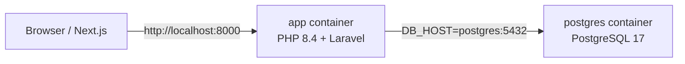

# Dockerizing the Laravel API

This guide explains how this project runs in Docker, what each file does, and how to work with the containerized stack day to day.

**Stack:** PHP 8.4 · Laravel 13 · PostgreSQL 17 · Docker Compose

---

## What gets containerized

| Service    | Container name          | Purpose                                      |
| ---------- | ----------------------- | -------------------------------------------- |
| `app`      | `example-app`           | Laravel API (`php artisan serve` on port 8000) |
| `postgres` | `example-app-postgres`  | PostgreSQL database                          |

The Next.js frontend is **not** part of this Compose file. It runs separately (default `http://localhost:3000`) and talks to the API at `http://localhost:8000`.

---

## Architecture



Inside the Docker network, the app reaches the database by **service name** (`postgres`), not `127.0.0.1`.

---

## Prerequisites

- [Docker Desktop](https://www.docker.com/products/docker-desktop/) (or Docker Engine + Compose v2)
- A copy of `.env` (start from `.env.example`)

No local PHP or Composer install is required if you only use Docker.

---

## Project files

```
example-app/
├── Dockerfile                 # PHP 8.4 image for the Laravel app
├── compose.yaml               # App + Postgres services
├── .dockerignore              # Excludes vendor, logs, etc. from build context
└── docker/
    ├── entrypoint.sh          # Bootstraps the app on container start
    └── postgres/
        └── init/
            └── 01-create-test-db.sh   # Creates the PHPUnit database on first Postgres boot
```

### `Dockerfile`

Builds a lightweight PHP CLI image:

- Base: `php:8.4-cli-bookworm`
- Extensions: `pdo_pgsql`, `bcmath`, `zip`
- Composer copied from the official `composer:2` image
- Runs `entrypoint.sh`, then starts the dev server

The server command uses `--no-reload` on purpose (see [Troubleshooting](#artisan-serve-and-environment-variables)).

### `compose.yaml`

Defines two services and two named volumes:

| Volume          | Mounted at              | Why |
| --------------- | ----------------------- | --- |
| Project bind mount | `/var/www/html`      | Live code changes on your machine are reflected in the container |
| `vendor`        | `/var/www/html/vendor`  | Linux Composer packages (avoids macOS/Windows vendor conflicts) |
| `postgres-data` | Postgres data directory | Persists database data between restarts |

The `app` service waits until `postgres` passes its health check before starting.

### `docker/entrypoint.sh`

Runs automatically every time the `app` container starts:

1. Copies `.env.example` → `.env` if `.env` is missing
2. Generates `APP_KEY` if not set
3. Runs `composer install`
4. Fixes permissions on `storage/` and `bootstrap/cache/`
5. Clears config cache and runs `php artisan migrate --force`
6. Executes the container `CMD` (starts `artisan serve`)

### `docker/postgres/init/01-create-test-db.sh`

Runs **once** when the Postgres data volume is first created. It creates `example_app_testing` for PHPUnit (see `phpunit.xml`).

---

## Environment variables

Key values in `.env` / `.env.example`:

```env
APP_URL=http://localhost:8000
DB_CONNECTION=pgsql
DB_HOST=postgres
DB_PORT=5432
DB_DATABASE=example_app
DB_USERNAME=laravel
DB_PASSWORD=secret
FRONTEND_URL=http://localhost:3000
SANCTUM_STATEFUL_DOMAINS=localhost:3000,127.0.0.1:3000
SESSION_DOMAIN=localhost
```

### `DB_HOST=postgres`

`postgres` is the **Docker Compose service name**. It resolves inside the `app` container to the database container.

| Where PHP runs | `DB_HOST` should be |
| -------------- | ------------------- |
| Inside Docker (`app` container) | `postgres` |
| On your Mac (`php artisan serve` locally) | `127.0.0.1` |

This project defaults to `postgres` because the API is intended to run in Docker.

---

## First-time setup

From the `example-app/` directory:

```bash
cp .env.example .env          # skip if you already have .env
docker compose up -d --build
```

The first start takes a few minutes while Composer installs dependencies into the `vendor` volume.

Verify:

```bash
curl http://localhost:8000/up     # health check → 200
curl http://localhost:8000/       # API root → {"application":"Laravel","status":"ok"}
```

---

## Daily workflow

```bash
# Start everything
docker compose up -d

# Stop containers (data is kept)
docker compose down

# View API logs
docker compose logs -f app

# View database logs
docker compose logs -f postgres

# Check status
docker compose ps
```

Edit PHP files on your host as usual — changes are picked up immediately because the project directory is bind-mounted.

---

## Running Artisan commands

Use `docker compose exec` so commands run inside the `app` container:

```bash
docker compose exec app php artisan migrate
docker compose exec app php artisan db:seed
docker compose exec app php artisan tinker
docker compose exec app php artisan route:list
docker compose exec app php artisan test
```

One-off commands without a running `app` container:

```bash
docker compose run --rm app php artisan migrate:status
```

---

## Database access

### From the host (TablePlus, psql, etc.)

Connect to the **published** Postgres port on your machine:

| Field    | Value           |
| -------- | --------------- |
| Host     | `127.0.0.1`     |
| Port     | `5432`          |
| User     | `laravel`       |
| Password | `secret`        |
| Database | `example_app`   |

```bash
docker exec -it example-app-postgres psql -U laravel -d example_app
```

### From the Laravel app

The app uses `DB_HOST=postgres` (the internal Docker hostname).

---

## Resetting data

```bash
# Stop and remove containers + volumes (destroys all DB data)
docker compose down -v

# Start fresh (migrations run automatically via entrypoint)
docker compose up -d --build
```

---

## Troubleshooting

### `Connection refused` to `127.0.0.1:5432`

The app is trying to reach Postgres on localhost inside the container. That is wrong — Postgres is a separate container.

**Fix:** Set `DB_HOST=postgres` in `.env` and restart:

```bash
docker compose restart app
```

### `artisan serve` and environment variables

Laravel's dev server (`php artisan serve`) spawns a PHP built-in server subprocess. By default it only forwards a small allowlist of environment variables (`APP_ENV`, `PATH`, etc.). **`DB_HOST` is not on that list.**

Without `--no-reload`, the subprocess reads `.env` directly. As long as `.env` has the correct `DB_HOST`, you are fine.

This project's `Dockerfile` uses:

```dockerfile
CMD ["php", "artisan", "serve", "--host=0.0.0.0", "--port=8000", "--no-reload"]
```

`--no-reload` passes the full container environment to the server process. Keep it when relying on Compose `environment:` overrides.

### Port already in use

If something else is bound to `8000` or `5432`, set a different host port:

```bash
APP_PORT=8080 DB_PORT=5433 docker compose up -d
```

Update `APP_URL` and your Next.js `NEXT_PUBLIC_REST_API_ENDPOINT` accordingly.

### Slow first boot

`composer install` runs on every container start. After the first run, packages live in the `vendor` volume and subsequent starts are faster.

### Permission errors on `storage/`

The entrypoint runs `chmod` on `storage/` and `bootstrap/cache/`. If issues persist:

```bash
docker compose exec app chmod -R ug+rwx storage bootstrap/cache
```

---

## How this was dockerized (step by step)

If you want to reproduce or adapt this setup for another Laravel project:

### 1. Add a `Dockerfile`

- Pick a PHP image matching your app (`php:8.4-cli-bookworm`)
- Install required extensions (`pdo_pgsql` for PostgreSQL)
- Copy Composer
- Set `WORKDIR` to the Laravel root
- Add an entrypoint script for bootstrapping
- Expose port `8000` and start `artisan serve` bound to `0.0.0.0`

### 2. Add `compose.yaml`

- **`app` service:** build from `Dockerfile`, publish port `8000`, bind-mount source code, depend on database health check
- **`postgres` service:** official Postgres image, env vars from `.env`, persistent volume, health check
- **Named `vendor` volume:** avoids cross-OS native extension issues

### 3. Add `docker/entrypoint.sh`

Automate first-run setup so `docker compose up` is enough:

- Ensure `.env` and `APP_KEY` exist
- `composer install`
- `php artisan migrate --force`

### 4. Configure `.env` for Docker networking

Set `DB_HOST` to the Compose **service name** (`postgres`), not `127.0.0.1`.

### 5. Add `.dockerignore`

Exclude `vendor/`, `node_modules/`, `.env`, and cache directories from the image build context.

### 6. (Optional) Postgres init scripts

Place shell/SQL files in `docker/postgres/init/` to create extra databases (e.g. a test database) on first boot.

---

## Production note

This setup uses `php artisan serve` and is intended for **local development**. For production, use a proper web server (Nginx or Caddy) with PHP-FPM, set `APP_ENV=production`, `APP_DEBUG=false`, run `php artisan config:cache`, and deploy via [Laravel Cloud](https://cloud.laravel.com) or your own orchestration.

See `README.md` for Laravel Cloud deployment commands.
